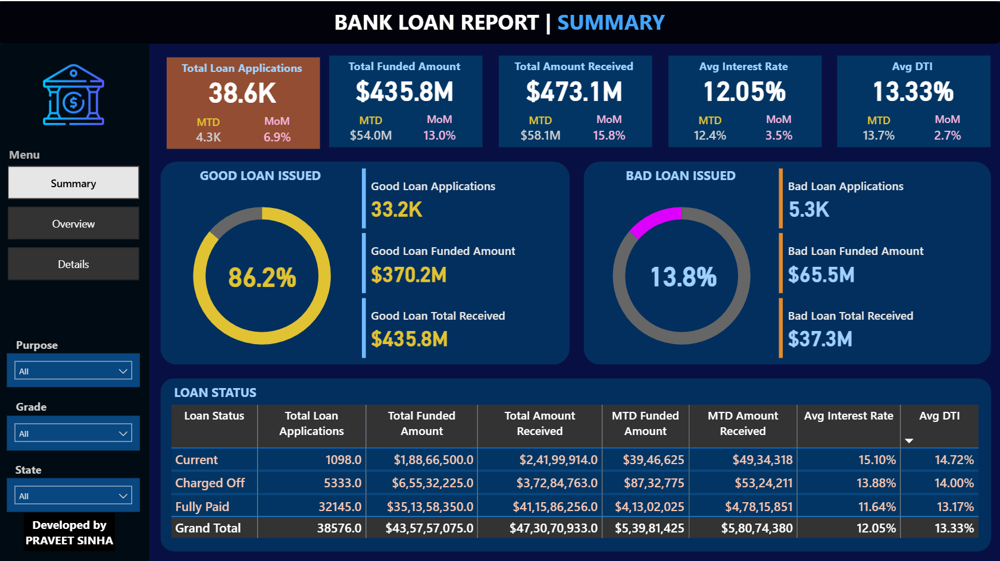
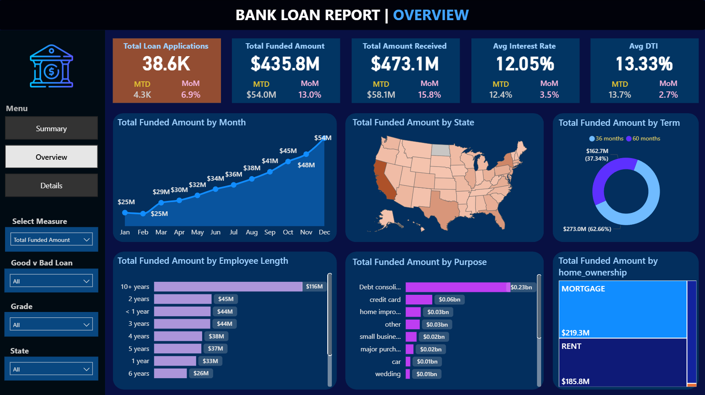
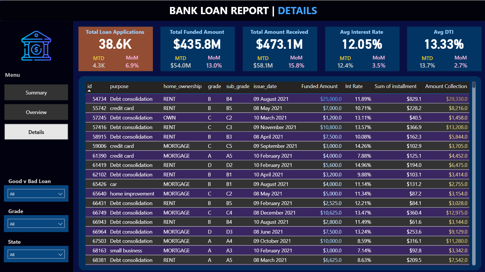

#  Bank Loan Dashboard (Power BI)

An interactive Power BI dashboard analyzing loan applications, funding trends, borrower characteristics, interest rates, and performance segmentation.

---

## Key Features

- **KPI Overview**  
  • **Total Applications**: 38.6K  
  • **Total Funded**: $435.8M  
  • **Total Received**: $473.1M  
  • **Avg Interest Rate**: 12.05%  
  • **Avg DTI**: 13.33%

- **Loan Classification**  
  • **Good Loans**: 86.2% of total  
  • **Bad Loans**: 13.8%  

- **Tabular Analysis**  
  • **Summary**: Snapshot of loan quality and metrics  
  • **Overview**: Trends by month, state, grade, purpose  
  • **Details**: Row-level dataset for deep analysis

- **Interactive Filtering**  
  • By **Grade**, **Purpose**, **State**, **Loan Type (Good/Bad)**

- **Monthly Trends**  
  • **MTD Funded**: $54M  
  • **MoM Growth**: 13%+  

---

##  Tools & Skills Used

- Power BI Desktop (DAX, visuals, drill-throughs, slicers)
- Data Transformation & Modeling
- Dashboard UX/UI Design
- Data Source: CSV (loan-level data)

---

##  Files Included

- `Bank_Loan_Dashboard.pbix` – Main Power BI file  
- `Loan_Details.csv` – Raw data source  
- `Dashboard_Preview.png` – Summary tab screenshot  
- `Report_overview.png` – Visual trends tab  
- `Loan_Details.png` – Row-level view  

---

##  Dashboard Preview

###  Summary Tab

###  Overview Tab

###  Details Tab

---

##  How to Use

1. **Download** the `.pbix` file from this repo  
2. **Open** it in [Power BI Desktop](https://powerbi.microsoft.com/)  
3. **Explore** insights using slicers and tabs  

---

##  Quick Insights

- **86.2%** of loans are **Good**, indicating high portfolio quality  
- Most borrowers live in **mortgaged or rented** homes  
- Largest loan purpose: **Debt Consolidation**  
- **60-month terms** dominate at **62.6%** of funded loans  
- Employee tenure correlates positively with **funded amount**
